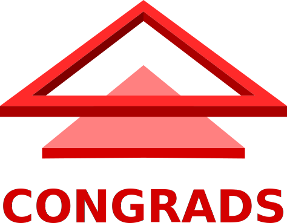
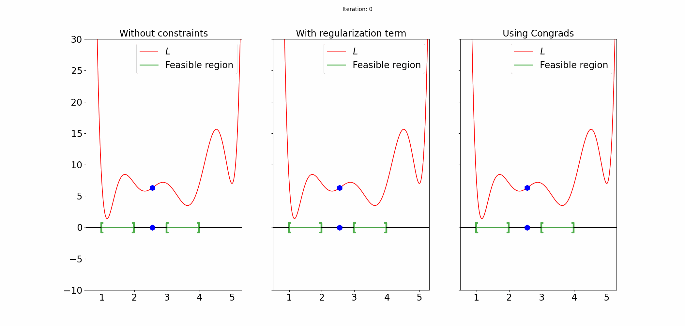

Welcome to Congrads' documentation!
===================================

|

|

Congrads is a Python toolbox that brings **constraint-guided gradient descent** capabilities 
to your machine learning projects. Built with seamless integration into PyTorch, 
Congrads empowers you to enhance the training and optimization process by 
*incorporating constraints* into your training pipeline.

.. note::

  The Congrads toolbox is currently **under active development**. Feedback, issue reports and pull requests are appreciated to further improve the toolbox and suit your needs.

Why should I use Congrads?
--------------------------
The **Congrads** toolbox provides an easy-to-use interface while remaining **highly flexible and modular**.
You can seamlessly adapt your existing projects to integrate constraints into your network while maintaining performance and stability.

Unlike traditional methods that enforce constraints through post-processing or penalty (regularization) functions, Congrads takes a different approach.
The algorithm does not interfere with the update step if the defined constraints are satisfied, ensuring that training progresses optimally.
However, if constraints are violated, Congrads adjusts the optimization process dynamically to steer the solution back into 
the feasible region, where all constraints are satisfied, helping maintain compliance without sacrificing convergence speed.

Possible applications include the following:

* Training models that obey real-world physical and operational limits.
* Embedding constraints that respect domain-specific restrictions.
* Integrate your own governing equations into the training of a deep learning model

Example problem
---------------

The animation above illustrates a simple example that makes use of the CGGD algorithm.
The objective here is to find the minimum of the function L, while enforcing that the solution must lay in certain intervals (marked in green), the so called feasible region.

As can be seen in the animation, both the approach without constraints and the approach with regularization fail to find a solution that satisfies the constraints and converge to a local minimum.
The CGGD algorithm on the other hand, does find an optimum that also satisfies the constraints.

Our approach has some advantages:

* Using Congrads you will always converge to points where all the constraints are satisfied and you can't get stuck in saddle points, local minima or maxima.
* This is in contrast to regularization approaches that can get stuck in points where not all constraints are satisfied or the loss is not minimal.
* Congrads uses no hyperparameters, which simplifies finding the optimal training settings.

Where to start
--------------

* :ref:`Quick-start guide <start>`
* :ref:`Core concepts <concepts>`
* :ref:`API documentation <api>`

Research
--------
If you make use of this package or it's concepts in your research, please consider citing the following papers.

- Van Baelen, Q., & Karsmakers, P. (2023). **Constraint guided gradient descent: 
  Training with inequality constraints with applications in regression and semantic segmentation.** 
  Neurocomputing, 556, 126636. doi:10.1016/j.neucom.2023.126636

  [`pdf`__, `bibtex`__]

__ https://www.sciencedirect.com/science/article/abs/pii/S0925231223007592
__ https://raw.githubusercontent.com/ML-KULeuven/congrads/main/docs/_static/VanBaelen2023.bib

Contacts
--------

Feel free to contact any of the below contact persons for more information or details about the project. Companies interested in a collaboration, or to set up joint research projects are also encouraged to get in touch with us.

- Peter Karsmakers [`email`__ | `website`__]
- Quinten Van Baelen [`email`__ | `website`__]

__ mailto:peter.karsmakers@kuleuven.be
__ https://www.kuleuven.be/wieiswie/en/person/00047893
__ mailto:quinten.vanbaelen@kuleuven.be
__ https://www.kuleuven.be/wieiswie/en/person/00125540

Contributors
------------

Below you find a list of people who contributed in making the toolbox. Feel free to contact them for any repository- or code-specific questions, suggestions or remarks.

- Wout Rombouts [`email`__ | `github profile`__]
- Quinten Van Baelen [`email`__ | `github profile`__]

__ mailto:wout.rombouts@kuleuven.be
__ https://github.com/rombie18
__ mailto:quinten.vanbaelen@kuleuven.be
__ https://github.com/quinten-vb

---

Contents
--------

.. toctree::
   :maxdepth: 2

   Home <self>
   start
   concepts
   api